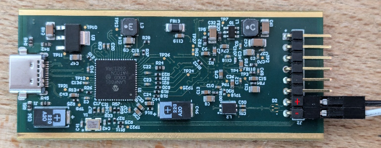

# HydraLink

Python module to control dissecto HydraLink on Linux and Windows

Can be either used as a standalone application, or as a module imported from another python program.

## Installation
Installing the pyusb module is only necessary on Linux

```bash
python3 -m venv .venv
source .venv/bin/activate
python -m pip install pyusb
```

## Usage

```bash
# Enable slave mode, 100 megabits speed
python -m hydralink

# Enable master mode, 100 megabits speed
python -m hydralink -m

# Enable slave mode, gigabit speed
python -m hydralink -g

# Enable master mode, gigabit speed
python -m hydralink -m -g

# Show the configuration gui. This requires the python tkinter module!
pyhton -m hydralink --gui
```

## API

```python
from hydralink import HydraLink
hl = HydraLink()
# master is True or False, speed is 100 or 1000.
hl.setup(master=True, speed=1000, promiscuous=True)
# If an option is not specified, the current value is not changed:
hl.setup(speed=100)
```

## Pinout

### HydraLink RC1
On HydraLink RC1, the positive terminal is on pin 7, and the negative terminal is on pin 8 (pin 1 is the pin marked by the dot).


1. GPIO4 (don't exceed 3.3V!)
2. GPIO5 (don't exceed 3.3V!)
3. GPIO6 (don't exceed 3.3V!)
4. GPIO7 (don't exceed 3.3V!)
5. GPIO8 (don't exceed 3.3V!)
6. Ground
7. Automotive Ethernet +
8. Automotive Ethernet -

## LEDs

When HydraLink is powered, 4 LEDs should turn on: red, orange, green, blue.

The red LED indicates that the HydraLink is powered.

While the HydraLink is not configured, the orange, green and blue are all turned on.

Once the HydraLink is configured, the meaning of the LEDs is:

The orange LED indicates that a 1 gb/s link is detected.

The green LED indicates that a 100 mb/s link is detected.

The blue LED indicated that there is activity on the link.

